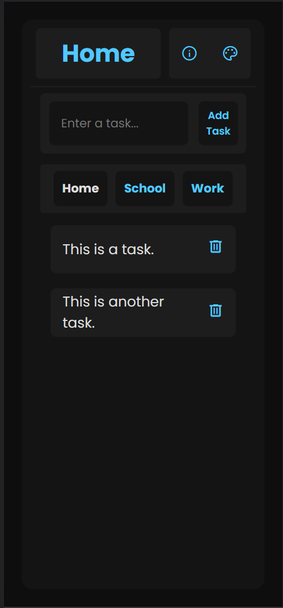
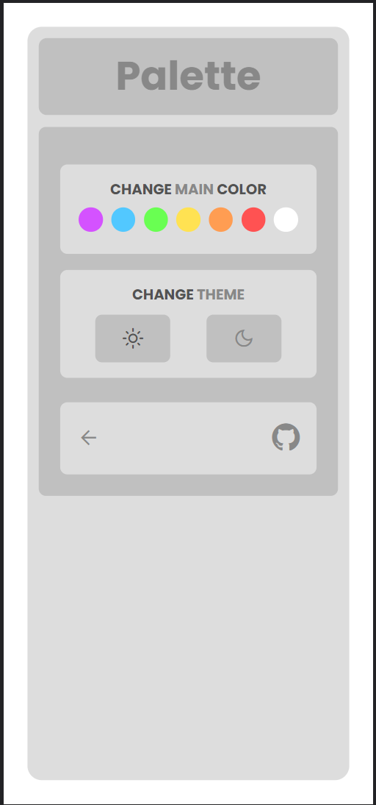
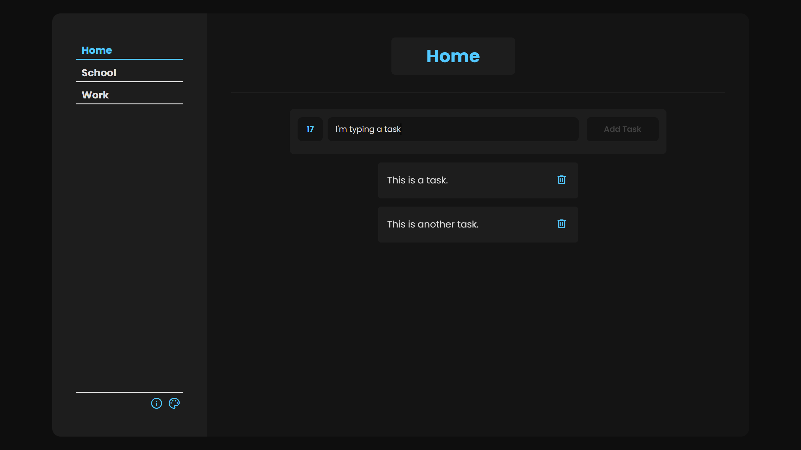

# ToDo APP being made with React.js

This is a simple TODO App made with React.js as my first project ever with React.
It has been really useful because it helped me to explore the big world of this JavaScript Library. I learned about Hooks, Components and JSX, and now, I can say I have a beginners level related to React. 

## Screenshots

With this project, I focused more on developing a pleasant and responsive mobile view. The desktop view is decent and as polished as the mobile one, but in my opinion, the mobile version is more comfortable and well-made.

### Mobile View 

### Customable - Dark Mode and Highlight Colors 

### Light Mode

### Desktop View**
